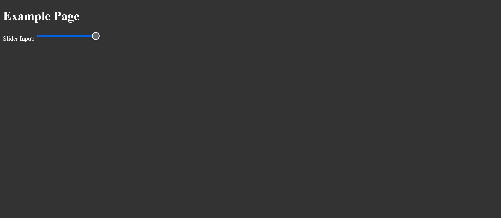

### Dimmer Switch

The Dimmer Switch is a user interface component that allows users to toggle between light, dim, and dark modes on a website. It provides a convenient way to adjust the visual appearance of the site according to user preferences.

  


### How to Use

To properly integrate the Dimmer Switch into any website, follow these steps:

1. **Download the Files**: Download the `dimmer-switch` folder containing the necessary HTML, CSS, and JavaScript files.

2. **Add HTML Markup**: Insert the HTML markup for the Dimmer Switch into your website's desired location. You can customize the appearance and placement of the switch as needed.

3. **Link JavaScript**: Ensure that the JavaScript file (`dimmer.js`) is linked properly in your HTML document, usually placed just before the closing `</body>` tag.

4. **Link CSS**: Link the CSS files (`light-styles.css`, `dim-styles.css`, and `dark-styles.css`) in the `<head>` section of your HTML document. If your website already has existing stylesheets for light, dim, and dark modes, you can skip this step.

5. **Customize Stylesheets**: If your website does not have existing stylesheets for dim and dark modes, create them based on your light mode stylesheet. Adjust the colors and other properties to achieve the desired visual appearance for each mode.

6. **Ensure Compatibility**: Test the Dimmer Switch across different browsers and devices to ensure compatibility and responsiveness.

7. **Optional Features**: Customize the behavior of the Dimmer Switch as needed. For example, you can add transitions or animations to enhance the user experience.

### Functionality

The Dimmer Switch provides the following functionality:

- **Toggle Modes**: Users can switch between light, dim, and dark modes by sliding the switch horizontally.
- **Dynamic Loading**: If dim and dark mode stylesheets are missing, the Dimmer Switch dynamically loads them when toggled to the corresponding mode.
- **Fallback Mechanism**: In case of any loading errors, the Dimmer Switch provides a fallback mechanism to ensure functionality.

### Compatibility

The Dimmer Switch is designed to be compatible with modern web browsers and responsive across various devices.

### Example

```html
<!DOCTYPE html>
<html lang="en">
<head>
    <meta charset="UTF-8">
    <meta name="viewport" content="width=device-width, initial-scale=1.0">
    <title>My Website</title>
    <link rel="stylesheet" href="light-styles.css">
    <!-- Add other stylesheets if necessary -->
</head>
<body>

<!-- Your website content -->

<!-- Dimmer Switch -->
<div class="dimmer-switch">
    <div class="handle"></div>
</div>

<script src="dimmer.js"></script>
</body>
</html>
```

### Contributions

Contributions to the Dimmer Switch project are welcome. If you encounter any issues or have suggestions for improvements, feel free to open an issue or submit a pull request.

### License

The Dimmer Switch is licensed under the Apache License 2.0. See the LICENSE file for more details.
